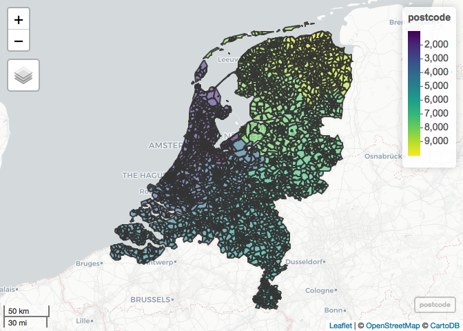

Prepare network data
================
Ate Poorthuis
11/9/2019

## Read edge data

The daily urban system data is based on the Dutch household travel
survey for the combined years 2004-2017. It was called
Mobiliteitsonderzoek Nederland (MON) until 2009; Onderzoek
Verplaatsingen Nederland (OViN) since. We combine all available years
together; only include trips with a known postcode for both start and
end; filter out all connections between postcodes with 5 or fewer
observations.

For daily urban systems, we only include trips with a purpose that is
not commuting. The data here are aggregated counts on the postcode
level. Eligible researchers can request access to the survey data
through <https://easy.dans.knaw.nl/ui/home>.

The central place system data is also based on the Dutch household
travel survey and has the same characteristics as the DUS data, except
we only include trips with shopping purpose.

The export basis system data is based on CBS microdata
(<https://www.cbs.nl/en-gb/our-services/customised-services-microdata/microdata-conducting-your-own-research>).
This dataset is based on the postal code of the employee and the postal
code of their location of employment on 31 December of a year. We
combine data for the years 2013-2016 and filter out all interactions
between pairs ofpostcodes with 10 or fewer observations (due to privacy
regulations).

Finally, we also use a dataset that consists of all trips recorded in
the household travel survey between 2004-2017 - aggregated to the
postcode level. We filter out all connections between postcodes with 10
or fewer observations and will subsequently use this data to combine
‘small’ postcodes with only very few connections (‘isolates’) with
their contiguous
neighbors.

``` r
dus <- read_csv(here("analysis", "data", "raw_data", "dus_pc_edges.csv"))
```

    ## Parsed with column specification:
    ## cols(
    ##   source = col_double(),
    ##   sink = col_double(),
    ##   weight = col_double(),
    ##   count = col_double()
    ## )

``` r
centralplace <- read_csv(here("analysis", "data", "raw_data", "centralplace_pc_edges.csv"))
```

    ## Parsed with column specification:
    ## cols(
    ##   source = col_double(),
    ##   sink = col_double(),
    ##   weight = col_double(),
    ##   count = col_double()
    ## )

``` r
export <- read_csv(here("analysis", "data", "raw_data", "export_pc_edges.csv"))
```

    ## Parsed with column specification:
    ## cols(
    ##   source = col_double(),
    ##   sink = col_double(),
    ##   weight = col_double(),
    ##   count = col_double()
    ## )

``` r
ovin <- read_csv(here("analysis", "data", "raw_data", "ovin_pc_edges.csv"))
```

    ## Parsed with column specification:
    ## cols(
    ##   source = col_double(),
    ##   sink = col_double(),
    ##   count = col_double(),
    ##   weight = col_double()
    ## )

## Read postcode polygon data

Postcode data for the Netherlands is published as open (address) data in
the [Basisregistratie Adressen en
Gebouwen](https://data.overheid.nl/data/dataset/basisregistratie-adressen-en-gebouwen--bag-).
Based on this data, ESRI Netherlands computes postcode polygons that are
[redistributed by the Centraal Bureau voor
Statistiek](https://www.cbs.nl/nl-nl/dossier/nederland-regionaal/geografische-data/gegevens-per-postcode)
under a [CC BY 3.0 NL
license](https://creativecommons.org/licenses/by/3.0/nl/).

``` r
postcode <- st_read(here("analysis", "data", "raw_data", "postcode_polygons", "CBS_ESRI_PC4_2017.shp"), crs = 28992, stringsAsFactors = F) %>% 
  mutate(pc4 = as.integer(pc4)) %>% 
  ms_simplify(keep_shapes = T) %>%  # pc geometry is much more detailed than we need, simplify
  st_buffer(dist = 0)
```

    ## Reading layer `CBS_ESRI_PC4_2017' from data source `/Users/ate/Documents/tesgcontainmentconnectivity/analysis/data/raw_data/postcode_polygons/CBS_ESRI_PC4_2017.shp' using driver `ESRI Shapefile'

    ## Warning: st_crs<- : replacing crs does not reproject data; use st_transform
    ## for that

    ## Simple feature collection with 4066 features and 1 field
    ## geometry type:  MULTIPOLYGON
    ## dimension:      XY
    ## bbox:           xmin: 13565.4 ymin: 306846.2 xmax: 278026.1 ymax: 619232.6
    ## epsg (SRID):    28992
    ## proj4string:    +proj=sterea +lat_0=52.15616055555555 +lon_0=5.38763888888889 +k=0.9999079 +x_0=155000 +y_0=463000 +ellps=bessel +towgs84=565.2369,50.0087,465.658,-0.406857,0.350733,-1.87035,4.0812 +units=m +no_defs

``` r
mapview::mapview(postcode)
```

<!-- -->

## Determine ‘isolates’

We need to determine which postcodes are ‘isolates’. These are generally
postcodes with very few trips going in or out (\<= 10, even over the 14
years of the household travel survey). If we don’t treat these, they
will end up as isolates on the map and thus will make the results + maps
difficult to interpret (merging procedure included in
`02-analysis-figures.Rmd`.

``` r
postcode_list <- postcode %>% st_set_geometry(NULL) %>% as_tibble() %>% rename(postcode = pc4)

source <- ovin %>% # we use the entire ovin dataset here
  filter(sink != source) %>% 
  group_by(source) %>% 
  summarise(outgoing = n()) %>% 
  rename("postcode" = "source")

sink <- ovin %>%
  filter(sink != source) %>% 
  group_by(sink) %>% 
  summarise(incoming = n()) %>% 
  rename("postcode" = "sink")

isolates <- full_join(source, sink) %>%
  right_join(., postcode_list) %>% 
  replace_na(list(incoming = 0, outgoing = 0)) %>% 
  mutate(total = incoming + outgoing) %>% 
  filter(total < 2) %>% 
  select(postcode)
```

    ## Joining, by = "postcode"
    ## Joining, by = "postcode"

``` r
write_rds(isolates, here("analysis", "data", "derived_data", "isolate_postcodes.rds"))
```

## Create network data & run community detection

We convert the urban system edge data to a Pajek format with `igraph`.
This is because the Pajek format is one of the formats supported by the
Infomap community detection algorithm/software.

Although there are [bindings available for
R](https://www.mapequation.org/code.html#Examples-with-R), we use the
stand-alone tool since it seems to be much faster and robust. The
Infomap software is open-source and can be
[downloaded](https://www.mapequation.org/code.html) and
[compiled](https://www.mapequation.org/code.html#Download-and-compile)
on both Linux and Mac operating systems. Here we assume the Infomap has
been downloaded and compiled to `path/to/project/inst/infomap/`.

We run the Infomap algorithm for different Markov times (increments of
0.10 - see paper) and use [GNU
Parallel](https://www.gnu.org/software/parallel/sem.html) to execute
runs in parallel (8 threads in the example below).

``` r
# dus
dus_graph <- dus %>% 
  filter(!source %in% isolates$postcode & !sink %in% isolates$postcode) %>% # remove links to isolate postcodes
  filter(source != sink) %>% # remove internal trips
  graph.data.frame(directed = T)

V(dus_graph)$id <- V(dus_graph)$name

write.graph(dus_graph, file=here("analysis", "data", "derived_data", "dus.net"), format="pajek")

# comment out the below if you have installed Infomap and want to run the community detection algorithm yourself

# system("mkdir -p analysis/data/derived_data/dus-communities; for i in `seq 0.10 0.10 7`; do sem -j8 inst/infomap/Infomap analysis/data/derived_data/dus.net . -N 500 --undirected --tree --two-level --markov-time $i --out-name analysis/data/derived_data/dus-communities/dus-$i --silent; done; sem --wait", intern = F)
```

``` r
cp_graph <- centralplace %>% 
  filter(!source %in% isolates$postcode & !sink %in% isolates$postcode) %>% 
  filter(source != sink) %>% 
  graph.data.frame(directed = T)

V(cp_graph)$id <- V(cp_graph)$name

write.graph(cp_graph, file=here("analysis", "data", "derived_data", "cp.net"), format="pajek")

# comment out the below if you have installed Infomap and want to run the community detection algorithm yourself

# system("mkdir -p analysis/data/derived_data/cp-communities; for i in `seq 0.10 0.10 7`; do sem -j8 inst/infomap/Infomap analysis/data/derived_data/cp.net . -N 500 --undirected --tree --two-level --markov-time $i --out-name analysis/data/derived_data/cp-communities/cp-$i --silent; done; sem --wait", intern = F)
```

``` r
ex_graph <- export %>% 
  filter(!source %in% isolates$postcode & !sink %in% isolates$postcode) %>% 
  filter(source != sink) %>% 
  graph.data.frame(directed = T)

V(ex_graph)$id <- V(ex_graph)$name

write.graph(ex_graph, file=here("analysis", "data", "derived_data", "ex.net"), format="pajek")

# comment out the below if you have installed Infomap and want to run the community detection algorithm yourself

# system("mkdir -p analysis/data/derived_data/ex-communities; for i in `seq 0.15 0.15 7`; do sem -j8 inst/infomap/Infomap analysis/data/derived_data/ex.net . -N 500 --undirected --tree --two-level --markov-time $i --out-name analysis/data/derived_data/ex-communities/ex-$i --silent; done; sem --wait", intern = F)
```
