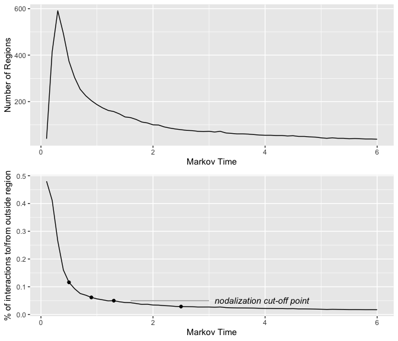
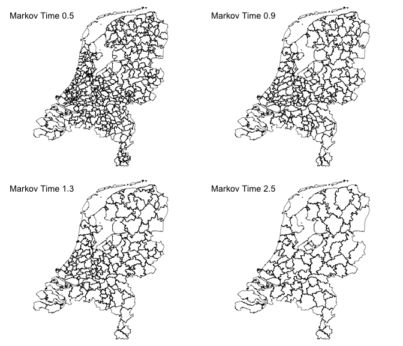
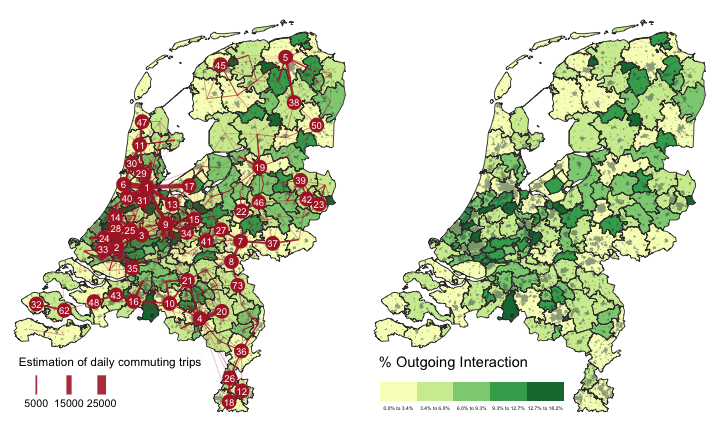
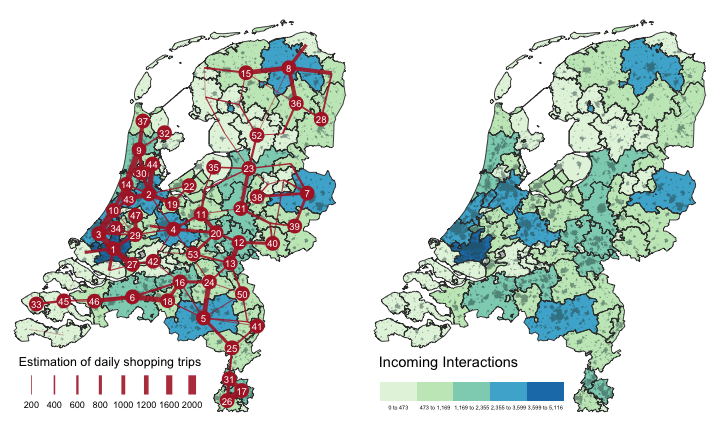
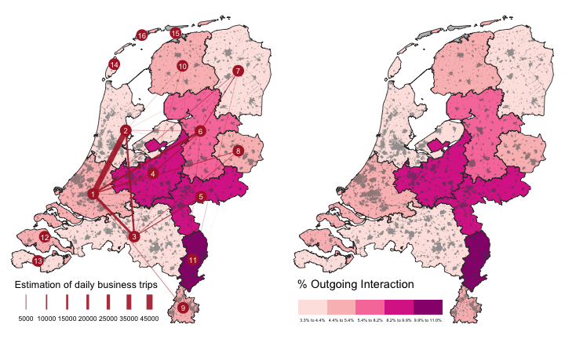
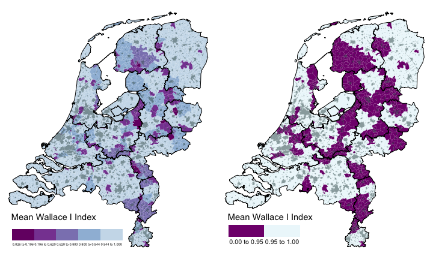

Analysis & Figures
================
Ate Poorthuis
11/10/2019

## Load results of community detection

We first load the results of the community detection procedure from the
`.tree` files generated by Infomap for each of the three systems.

``` r
# we need the postcode data again so load that first
postcode <- st_read(here("analysis", "data", "raw_data", "postcode_polygons", "CBS_ESRI_PC4_2017.shp"), crs = 28992, stringsAsFactors = F) %>% 
  mutate(pc4 = as.integer(pc4)) %>% 
  ms_simplify(keep_shapes = T) %>%  # pc geometry is much more detailed than we need, simplify
  st_buffer(dist = 0)
```

    ## Reading layer `CBS_ESRI_PC4_2017' from data source `/Users/ate/Documents/tesgcontainmentconnectivity/analysis/data/raw_data/postcode_polygons/CBS_ESRI_PC4_2017.shp' using driver `ESRI Shapefile'

    ## Warning: st_crs<- : replacing crs does not reproject data; use st_transform
    ## for that

    ## Simple feature collection with 4066 features and 1 field
    ## geometry type:  MULTIPOLYGON
    ## dimension:      XY
    ## bbox:           xmin: 13565.4 ymin: 306846.2 xmax: 278026.1 ymax: 619232.6
    ## epsg (SRID):    28992
    ## proj4string:    +proj=sterea +lat_0=52.15616055555555 +lon_0=5.38763888888889 +k=0.9999079 +x_0=155000 +y_0=463000 +ellps=bessel +towgs84=565.2369,50.0087,465.658,-0.406857,0.350733,-1.87035,4.0812 +units=m +no_defs

``` r
isolates <- read_rds(here("analysis", "data", "derived_data", "isolate_postcodes.rds"))
```

``` r
dus <- read_csv(here("analysis", "data", "raw_data", "dus_pc_edges.csv"))
dus_com <- map(seq(0.10, 6, by = 0.10), function(i) {
  tesgcontainmentconnectivity::com_extract(here("analysis", "data", "derived_data", "dus-communities", paste0("dus-", i, ".tree")))
})
dus_stats <- tibble(markov = seq(0.10, 6, by = 0.10), 
                    members = map_int(dus_com, tesgcontainmentconnectivity::com_count),
                    codeLength = map_chr(seq(0.10, 6, by = 0.10), function(i) {
                      tesgcontainmentconnectivity::codeLength_extract(here("analysis", "data", "derived_data", "dus-communities", paste0("dus-", i, ".tree")))
                    }),
                    external = map_dbl(dus_com, function(com) tesgcontainmentconnectivity::com_external(com, totalFlow = dus, isolates = isolates)),
                    externalMedian = map_dbl(dus_com, function(com) tesgcontainmentconnectivity::com_externalMedian(com, totalFlow = dus, isolates = isolates))
) %>% 
  mutate(codeLength = as.numeric(codeLength))
dus_stats    
```

    ## # A tibble: 60 x 5
    ##    markov members codeLength external externalMedian
    ##     <dbl>   <int>      <dbl>    <dbl>          <dbl>
    ##  1    0.1      40       1.58   0.480          0.517 
    ##  2    0.2     414       2.85   0.411          0.501 
    ##  3    0.3     591       3.72   0.265          0.394 
    ##  4    0.4     493       4.22   0.161          0.208 
    ##  5    0.5     374       4.54   0.116          0.140 
    ##  6    0.6     304       4.78   0.0931         0.119 
    ##  7    0.7     253       4.99   0.0758         0.0989
    ##  8    0.8     225       5.15   0.0697         0.0872
    ##  9    0.9     204       5.30   0.0617         0.0783
    ## 10    1       187       5.43   0.0565         0.0680
    ## # … with 50 more rows

``` r
centralplace <- read_csv(here("analysis", "data", "raw_data", "centralplace_pc_edges.csv"))
cp_com <- map(seq(0.10, 7, by = 0.10), function(i) {
  tesgcontainmentconnectivity::com_extract(here("analysis", "data", "derived_data", "cp-communities", paste0("cp-", i, ".tree")))
})

cp_stats <- tibble(markov = seq(0.10, 7, by = 0.10), 
                   members = map_int(cp_com, tesgcontainmentconnectivity::com_count),
                   codeLength = map_chr(seq(0.10, 7, by = 0.10), function(i) {
                     tesgcontainmentconnectivity::codeLength_extract(here("analysis", "data", "derived_data", "cp-communities", paste0("cp-", i, ".tree")))
                   }),
                   external = map_dbl(cp_com, function(com) tesgcontainmentconnectivity::com_external(com, totalFlow = centralplace, isolates = isolates)),
                   externalMedian = map_dbl(cp_com, function(com) tesgcontainmentconnectivity::com_externalMedian(com, totalFlow = centralplace, isolates = isolates))
) %>% 
  mutate(codeLength = as.numeric(codeLength))
cp_stats                  
```

    ## # A tibble: 70 x 5
    ##    markov members codeLength external externalMedian
    ##     <dbl>   <int>      <dbl>    <dbl>          <dbl>
    ##  1    0.1     155       1.54   0.455          0.553 
    ##  2    0.2     598       2.65   0.320          0.443 
    ##  3    0.3     641       3.25   0.182          0.247 
    ##  4    0.4     519       3.60   0.116          0.135 
    ##  5    0.5     424       3.84   0.0821         0.0960
    ##  6    0.6     368       4.02   0.0704         0.0776
    ##  7    0.7     322       4.18   0.0581         0.0673
    ##  8    0.8     297       4.30   0.0518         0.0594
    ##  9    0.9     276       4.42   0.0471         0.0555
    ## 10    1       264       4.52   0.0415         0.0514
    ## # … with 60 more rows

``` r
export <- read_csv(here("analysis", "data", "raw_data", "export_pc_edges.csv"))
ex_com <- map(seq(0.15, 7, by = 0.15), function(i) {
  tesgcontainmentconnectivity::com_extract(here("analysis", "data", "derived_data", "ex-communities", paste0("ex-", i, ".tree")))
})
ex_stats <- tibble(markov = seq(0.15, 7, by = 0.15), 
                   members = map_int(ex_com, tesgcontainmentconnectivity::com_count),
                   codeLength = map_chr(seq(0.15, 7, by = 0.15), function(i) {
                     tesgcontainmentconnectivity::codeLength_extract(here("analysis", "data", "derived_data", "ex-communities", paste0("ex-", i, ".tree")))
                   }),
                   external = map_dbl(ex_com, function(com) tesgcontainmentconnectivity::com_external(com, totalFlow = export, isolates = isolates)),
                   externalMedian = map_dbl(ex_com, function(com) tesgcontainmentconnectivity::com_externalMedian(com, totalFlow = export, isolates = isolates))
)
ex_stats                  
```

    ## # A tibble: 46 x 5
    ##    markov members codeLength  external externalMedian
    ##     <dbl>   <int> <chr>          <dbl>          <dbl>
    ##  1  0.15        7 2.270721685    0.854          0.864
    ##  2  0.3       135 4.240626197    0.826          0.869
    ##  3  0.450     252 5.805657627    0.653          0.891
    ##  4  0.6       152 6.646298715    0.423          0.900
    ##  5  0.75       88 7.058903781    0.227          0.289
    ##  6  0.9        60 7.388348498    0.180          0.218
    ##  7  1.05       49 7.643788501    0.151          0.205
    ##  8  1.2        36 7.827003686    0.125          0.138
    ##  9  1.35       37 8.004564889    0.130          0.147
    ## 10  1.50       32 8.140380717    0.116          0.123
    ## # … with 36 more rows

``` r
# set 'chosen' urban system based on theoretical cut-off
dus_i <- which.min(dus_stats$external > 0.05)
cp_i <- which.min(cp_stats$external > 0.01)
ex_i <- which.min(ex_stats$external > 0.06)
```

## Merge isolates postcodes with their nearest neighbor

We calculate a distance matrix between all postcodes and merge isolates
with their nearest neighbor based on this matrix. This is so the
resulting maps are not ‘cluttered’ with isolated postcodes.

``` r
filter_out <- postcode %>% 
  left_join(ex_com[[ex_i]], by=c("pc4" = "name")) %>% 
  rename("exp" = "community") %>% 
  left_join(cp_com[[cp_i]], by=c("pc4" = "name")) %>% 
  rename("cp" = "community") %>% 
  left_join(dus_com[[dus_i]], by=c("pc4" = "name")) %>% 
  rename("dus" = "community") %>% 
  as_tibble() %>%
  filter((is.na(exp) | is.na(cp) | is.na(dus))) %>% 
  st_as_sf()

filter_in <- postcode %>% 
  left_join(ex_com[[ex_i]], by=c("pc4" = "name")) %>% 
  rename("exp" = "community") %>% 
  left_join(cp_com[[cp_i]], by=c("pc4" = "name")) %>% 
  rename("cp" = "community") %>% 
  left_join(dus_com[[dus_i]], by=c("pc4" = "name")) %>% 
  rename("dus" = "community") %>% 
  as_tibble() %>%
  filter(!(is.na(exp) | is.na(cp) | is.na(dus))) %>% 
  st_as_sf()

dist <- st_distance(filter_in, filter_out)
filter_replace <- filter_out %>% 
  mutate(index = row_number()) %>% 
  rowwise() %>% 
  mutate(closest = which.min(dist[,index])) %>% 
  rowwise() %>% 
  mutate(merge_with = filter_in[closest,]$pc4) %>% 
  select(pc4, merge_with)

postcode_with_isolates_merged <- postcode %>%
  left_join(filter_replace, by = c("pc4" = "pc4")) %>% 
  mutate(merge_with=coalesce(merge_with,pc4)) %>% 
  mutate(pc4 = merge_with) %>% 
  select(pc4) %>% 
  group_by(pc4) %>% 
  summarise(count = n()) %>% 
  ms_simplify(keep = 0.9, keep_shapes = T) %>% 
  st_buffer(dist = 0)
```

## Figure 2

``` r
p1 <- dus_stats %>% 
  ggplot() + geom_line(aes(x = markov, y = members)) + xlab("Markov Time") + ylab("Number of Regions")

p2 <- dus_stats %>% 
  ggplot() + geom_line(aes(x = markov, y = external)) + xlab("Markov Time") + ylab("% of interactions to/from outside region") +
  annotate("text", x = 3.1, y = 0.05, hjust = 0, vjust = 0.4, label = "nodalization cut-off point", fontface = "italic") + 
  annotate("segment", x = 1.6, xend = 3, y = 0.05, yend = 0.05, color = "darkgray") +
  annotate("point", x = dus_stats$markov[5], y = dus_stats$external[5]) +
  annotate("point", x = dus_stats$markov[9], y = dus_stats$external[9]) +
  annotate("point", x = dus_stats$markov[13], y = dus_stats$external[13]) +
  annotate("point", x = dus_stats$markov[25], y = dus_stats$external[25])

p1 + p2 + plot_layout(ncol = 1)
```

<!-- -->

``` r
# ggsave("Figure 2a.pdf", height = 6)

map1 <- tesgcontainmentconnectivity::comm_merge(dus_com[[5]], postcode_with_isolates_merged, dus_i) %>% 
  ms_simplify(keep = 0.9, keep_shapes = T) %>%  # clean up some weird lines after merging
  tm_shape() + tm_borders(lwd = 0.5, col = "black") + tm_layout(frame = F) + tm_layout(title = "Markov Time 0.5", title.size = 0.9)

map2 <- tesgcontainmentconnectivity::comm_merge(dus_com[[9]], postcode_with_isolates_merged, dus_i) %>% 
  ms_simplify(keep = 0.9, keep_shapes = T) %>%  # clean up some weird lines after merging
  tm_shape() + tm_borders(lwd = 0.5, col = "black") + tm_layout(frame = F) + tm_layout(title = "Markov Time 0.9", title.size = 0.9)

map3 <- tesgcontainmentconnectivity::comm_merge(dus_com[[13]], postcode_with_isolates_merged, dus_i) %>% 
  ms_simplify(keep = 0.9, keep_shapes = T) %>%  # clean up some weird lines after merging
  tm_shape() + tm_borders(lwd = 0.5, col = "black") + tm_layout(frame = F) + tm_layout(title = "Markov Time 1.3", title.size = 0.9)

map4 <- tesgcontainmentconnectivity::comm_merge(dus_com[[25]], postcode_with_isolates_merged, dus_i) %>% 
  ms_simplify(keep = 0.9, keep_shapes = T) %>%  # clean up some weird lines after merging
  tm_shape() + tm_borders(lwd = 0.5, col = "black") + tm_layout(frame = F) + tm_layout(title = "Markov Time 2.5", title.size = 0.9)

tmap_arrange(list(map1, map2, map3, map4), ncol = 2)
```

<!-- -->

``` r
# tmap_save(tmap_arrange(list(map1, map2, map3, map4), ncol = 2), filename = "Figure2b.pdf", height = 6)
```

## Figure 3

We need a background layer to indicate towns/built-up areas. We use the
TOP10NL built-up place layer (‘plaats’). Easy-to-use extracts used to be
provided [by Jan-Willem van Aalst at
Imergis](https://www.imergis.nl/htm/opendata.htm) but as of 1 November
2019, they are no longer available. Instead, download TOP10NL data
directly from
[PDOK](https://www.pdok.nl/introductie/-/article/basisregistratie-topografie-brt-topnl).
TOP10NL data is made available by the Dutch Kadaster as part of the
Basisregistratie Topografie (BRT) under a CC BY 4.0
license.

``` r
towns <- st_read(here("analysis", "data", "raw_data", "top10_buildup", "Top10NL-Plaats_kern.shp")) %>% 
  select(naamnl) %>% 
  ms_simplify(keep = 0.09) %>% 
  st_buffer(dist = 0)
```

    ## Reading layer `Top10NL-Plaats_kern' from data source `/Users/ate/Documents/tesgcontainmentconnectivity/analysis/data/raw_data/top10_buildup/Top10NL-Plaats_kern.shp' using driver `ESRI Shapefile'
    ## Simple feature collection with 2904 features and 23 fields
    ## geometry type:  MULTIPOLYGON
    ## dimension:      XY
    ## bbox:           xmin: 13841.05 ymin: 308044 xmax: 277756.7 ymax: 611107.5
    ## epsg (SRID):    28992
    ## proj4string:    +proj=sterea +lat_0=52.15616055555555 +lon_0=5.38763888888889 +k=0.9999079 +x_0=155000 +y_0=463000 +ellps=bessel +towgs84=565.2369,50.0087,465.658,-0.406857,0.350733,-1.87035,4.0812 +units=m +no_defs

``` r
towns_plot <- tm_shape(towns) + tm_fill(col = "#2F4F4F", alpha = 0.5)
```

``` r
# the edges between communities in the DUS are based on commuting flows
dus_flow <- read_csv(here("analysis", "data", "raw_data", "export_pc_edges.csv"))
```

    ## Parsed with column specification:
    ## cols(
    ##   source = col_double(),
    ##   sink = col_double(),
    ##   weight = col_double(),
    ##   count = col_double()
    ## )

``` r
dus_flow <- tesgcontainmentconnectivity::merge_flow(dus_flow, dus_com[[dus_i]], isolates)

dus_final <- tesgcontainmentconnectivity::com_statsPerCom(dus_com[[dus_i]], dus, isolates) %>% 
  filter(internal > 1000)
```

    ## Joining, by = "com"

    ## Joining, by = "com"

``` r
dus_final_sf <- tesgcontainmentconnectivity::comm_merge(dus_com[[dus_i]], postcode_with_isolates_merged, dus_i) %>% 
  left_join(dus_final, by = c("community" = "com")) %>% 
  ms_simplify(keep = 0.9, keep_shapes = T) # clean up some weird lines after merging

dus_centroid <- st_centroid(tesgcontainmentconnectivity::comm_merge(dus_com[[dus_i]], postcode_with_isolates_merged, dus_i)) %>%
  select(community) %>%
  left_join(., dus_final, by = c("community" = "com"))
```

    ## Warning in
    ## st_centroid.sf(tesgcontainmentconnectivity::comm_merge(dus_com[[dus_i]], :
    ## st_centroid assumes attributes are constant over geometries of x

``` r
dus_lines <- dus_flow %>%
  left_join(dus_centroid, by = c("source" = "community")) %>%
  left_join(dus_centroid, by = c("sink" = "community")) %>%
  drop_na() %>% 
  filter(weight > 100) %>% # filter very small interactions
  rowwise() %>%
  mutate(geometry = st_combine(c(geometry.x, geometry.y)) %>% st_cast("LINESTRING")) %>% select(-geometry.x, -geometry.y) %>%
  st_as_sf(crs = 28992)

dus_outline <- tm_shape(dus_final_sf) + tm_borders(lwd = 0.9, col = "#383838")

dus_fill <- tm_shape(dus_final_sf) + tm_fill(col = "outgoingRel", style = "jenks", palette = "YlGn", showNA = F,
                                        legend.is.portrait = F, title = "% Outgoing Interaction") + 
  tm_legend(legend.position = c("left", "bottom"), legend.width = 0.55,
            legend.format = list(text.separator = "to", fun=function(x) paste0(formatC(x*100, digits=1, format="f"), "%")))

dus_fill_no_legend <- tm_shape(dus_final_sf) + 
  tm_fill(col = "outgoingRel", palette = "YlGn",  showNA = F, n = 5,
                                                  style = "jenks", 
                                                  legend.is.portrait = F, title = "Incoming Interactions", legend.show = F) + 
  tm_legend(legend.position = c("left", "bottom"), legend.width = 0.55)

dus_line_plot <- tm_shape(dus_lines) + tm_lines(col = "#B02430", lwd = "weight", alpha = 0.9, scale = 8, n = 5, legend.lwd.is.portrait = F,
                                                title.lwd = "Estimation of daily commuting trips") +
 tm_legend(legend.position = c("left", "bottom"), legend.width = 0.55, 
            legend.format = list(fun=function(x) formatC(x, digits=0, format="f"))) + tm_shape(dus_centroid %>% top_n(50, internal)) + tm_bubbles(col = "#B02430", size = 0.6, border.lwd = 0) + tm_text(text = "community", col = "white", size = 0.6)

fig3a <- dus_fill + towns_plot + dus_outline + tm_layout(frame = F)
fig3b <- dus_fill_no_legend + towns_plot + dus_outline + dus_line_plot + tm_layout(frame = F)

tmap_arrange(list(fig3b, fig3a), ncol = 2)
```

    ## Legend labels were too wide. Therefore, legend.text.size has been set to 0.31. Increase legend.width (argument of tm_layout) to make the legend wider and therefore the labels larger.

<!-- -->

``` r
#tmap_save(tmap_arrange(list(fig3b, fig3a), ncol = 2), filename = "Figure3.pdf", width = 7.5, height = 4.5)
```

## Figure 4

``` r
# the edges between communities in the CP system are based on shopping flows
cp_flow <- read_csv(here("analysis", "data", "raw_data", "centralplace_pc_edges.csv"))
```

    ## Parsed with column specification:
    ## cols(
    ##   source = col_double(),
    ##   sink = col_double(),
    ##   weight = col_double(),
    ##   count = col_double()
    ## )

``` r
cp_flow <- tesgcontainmentconnectivity::merge_flow(cp_flow, cp_com[[cp_i]], isolates)

cp_final <- tesgcontainmentconnectivity::com_statsPerCom(cp_com[[cp_i]], centralplace, isolates) %>%
  filter(internal > 1000) %>% 
  mutate(balance = incoming - outgoing) %>% 
  mutate(incomeRel = incoming / internal)
```

    ## Joining, by = "com"

    ## Joining, by = "com"

``` r
cp_final_sf <- tesgcontainmentconnectivity::comm_merge(cp_com[[cp_i]], postcode_with_isolates_merged, cp_i) %>% 
  left_join(cp_final, by = c("community" = "com")) %>% 
  ms_simplify(keep = 0.9, keep_shapes = T) # clean up some weird lines after merging
```

    ## Warning in eval(call(as_fun, df[[n]])): NAs introduced by coercion
    
    ## Warning in eval(call(as_fun, df[[n]])): NAs introduced by coercion
    
    ## Warning in eval(call(as_fun, df[[n]])): NAs introduced by coercion
    
    ## Warning in eval(call(as_fun, df[[n]])): NAs introduced by coercion
    
    ## Warning in eval(call(as_fun, df[[n]])): NAs introduced by coercion
    
    ## Warning in eval(call(as_fun, df[[n]])): NAs introduced by coercion

``` r
cp_centroid <- st_centroid(tesgcontainmentconnectivity::comm_merge(cp_com[[cp_i]], postcode_with_isolates_merged, cp_i)) %>% select(community) %>% left_join(., cp_final, by = c("community" = "com"))
```

    ## Warning in
    ## st_centroid.sf(tesgcontainmentconnectivity::comm_merge(cp_com[[cp_i]], :
    ## st_centroid assumes attributes are constant over geometries of x

``` r
cp_lines <- cp_flow %>%
  left_join(cp_centroid, by = c("source" = "community")) %>%
  left_join(cp_centroid, by = c("sink" = "community")) %>%
  rowwise() %>%
  mutate(geometry = st_combine(c(geometry.x, geometry.y)) %>% st_cast("LINESTRING")) %>% select(-geometry.x, -geometry.y) %>%
  st_as_sf(crs = 28992)

cp_fill <- tm_shape(cp_final_sf) + tm_fill(col = "incoming",palette = "GnBu",  showNA = F, n = 5,
                                      style = "jenks", 
                                      legend.is.portrait = F, title = "Incoming Interactions") + 
  tm_legend(legend.position = c("left", "bottom"), legend.width = 0.55)
cp_outline <- tm_shape(cp_final_sf) + tm_borders(lwd = 0.9, col = "#383838")

cp_fill_no_legend <- tm_shape(cp_final_sf) + tm_fill(col = "incoming",palette = "GnBu",  showNA = F, n = 5,
                                                style = "jenks", 
                                                legend.is.portrait = F, title = "Incoming Interactions", legend.show = F) + 
  tm_legend(legend.position = c("left", "bottom"), legend.width = 0.55)
cp_line_plot <- tm_shape(cp_lines) + tm_lines(col = "#B02430", lwd = "weight", alpha = 0.9, scale = 7, n = 5, legend.lwd.is.portrait = F,
                                              title.lwd = "Estimation of daily shopping trips") +
  tm_legend(legend.position = c("left", "bottom"), legend.width = 0.55, 
            legend.format = list(fun=function(x) formatC(x, digits=0, format="f"))) + tm_shape(cp_centroid %>% top_n(50, internal)) + tm_bubbles(col = "#B02430", size = 0.6, border.lwd = 0) + tm_text(text = "community", col = "white", size = 0.6)

fig4a <- cp_fill + towns_plot + cp_outline + tm_layout(frame = F)
fig4b <- cp_fill_no_legend + towns_plot + cp_outline + cp_line_plot + tm_layout(frame = F)

tmap_arrange(list(fig4b, fig4a), ncol = 2)
```

    ## Legend labels were too wide. Therefore, legend.text.size has been set to 0.57. Increase legend.width (argument of tm_layout) to make the legend wider and therefore the labels larger.

    ## Legend labels were too wide. Therefore, legend.text.size has been set to 0.34. Increase legend.width (argument of tm_layout) to make the legend wider and therefore the labels larger.

<!-- -->

``` r
# tmap_save(tmap_arrange(list(fig4b, fig4a), ncol = 2), filename = "Figure4.pdf", width = 7.5, height = 4.5)
```

## Figure 5

``` r
# the edges between communities in the export base system are based on business trips
# because these are relatively infrequent between postcodes, the filtered (>5 trips) aggregated postcode OD matrix would suppress too many connections
# instead we share the aggregated community matrix, which has been constructed using the `tesgcontainmentconnectivity::merge_flow` function used for both the DUS and CP data above
ex_flow <- read_csv(here("analysis", "data", "raw_data", "export_community_edges.csv"), col_types = list("c", "c", "d","d"))

ex_final <- tesgcontainmentconnectivity::com_statsPerCom(ex_com[[ex_i]], export, isolates) %>% 
  filter(internal > 1000)
```

    ## Joining, by = "com"
    ## Joining, by = "com"

``` r
ex_final_sf <- tesgcontainmentconnectivity::comm_merge(ex_com[[ex_i]], postcode_with_isolates_merged, ex_i) %>% 
  left_join(ex_final, by = c("community" = "com")) %>% 
  ms_simplify(keep = 0.9, keep_shapes = T) # clean up some weird lines after merging
```

    ## Warning in eval(call(as_fun, df[[n]])): NAs introduced by coercion
    
    ## Warning in eval(call(as_fun, df[[n]])): NAs introduced by coercion
    
    ## Warning in eval(call(as_fun, df[[n]])): NAs introduced by coercion
    
    ## Warning in eval(call(as_fun, df[[n]])): NAs introduced by coercion

``` r
ex_centroid <- st_centroid(tesgcontainmentconnectivity::comm_merge(ex_com[[ex_i]], postcode_with_isolates_merged, ex_i)) %>% select(community)
```

    ## Warning in
    ## st_centroid.sf(tesgcontainmentconnectivity::comm_merge(ex_com[[ex_i]], :
    ## st_centroid assumes attributes are constant over geometries of x

``` r
ex_lines <- ex_flow %>%
  left_join(ex_centroid, by = c("source" = "community")) %>%
  left_join(ex_centroid, by = c("sink" = "community")) %>%
  rowwise() %>%
  mutate(geometry = st_combine(c(geometry.x, geometry.y)) %>% st_cast("LINESTRING")) %>% select(-geometry.x, -geometry.y) %>%
  st_as_sf(crs = 28992)

ex_fill <- tm_shape(ex_final_sf) + tm_fill(col = "outgoingRel", style = "jenks", palette = "RdPu", showNA = F,
                                      legend.is.portrait = F, title = "% Outgoing Interaction") + 
  tm_legend(legend.position = c("left", "bottom"), legend.width = 0.55,
            legend.format = list(text.separator = "to", fun=function(x) paste0(formatC(x*100, digits=1, format="f"), "%")))

ex_outline <- tm_shape(ex_final_sf) + tm_borders(lwd = 0.9, col = "#383838")

ex_fill_no_legend <- tm_shape(ex_final_sf) + tm_fill(col = "outgoingRel", style = "jenks", palette = "RdPu", showNA = F,
                                                legend.is.portrait = F, title = "% Outgoing Interaction", legend.show = F)
ex_line_plot <- tm_shape(ex_lines) + tm_lines(col = "#B02430", lwd = "weight", alpha = 0.9, scale = 7, n = 5, legend.lwd.is.portrait = F,
                                              title.lwd = "Estimation of daily business trips") +
  tm_legend(legend.position = c("left", "bottom"), legend.width = 0.55, 
            legend.format = list(fun=function(x) formatC(x, digits=0, format="f"))) + tm_shape(ex_centroid) + tm_bubbles(col = "#B02430", size = 0.6, border.lwd = 0) + tm_text(text = "community", col = "white", size = 0.6)


fig5a <- ex_fill + towns_plot + ex_outline + tm_layout(frame = F)
fig5b <- ex_fill_no_legend + towns_plot + ex_outline + ex_line_plot + tm_layout(frame = F)

tmap_arrange(list(fig5b, fig5a), ncol = 2)
```

    ## Legend labels were too wide. Therefore, legend.text.size has been set to 0.53. Increase legend.width (argument of tm_layout) to make the legend wider and therefore the labels larger.

    ## Legend labels were too wide. Therefore, legend.text.size has been set to 0.33. Increase legend.width (argument of tm_layout) to make the legend wider and therefore the labels larger.

<!-- -->

``` r
# tmap_save(tmap_arrange(list(fig5b, fig5a), ncol = 2), filename = "Figure5.pdf", width = 7.5, height = 4.5)
```

## Figure 7

``` r
postcode_all_systems <- postcode_with_isolates_merged %>% 
  left_join(ex_com[[ex_i]], by=c("pc4" = "name")) %>% 
  rename("exp" = "community") %>% 
  left_join(cp_com[[cp_i]], by=c("pc4" = "name")) %>% 
  rename("cp" = "community") %>% 
  left_join(dus_com[[dus_i]], by=c("pc4" = "name")) %>% 
  rename("dus" = "community") %>% 
  as_tibble() %>%
  filter(!(is.na(exp) | is.na(cp) | is.na(dus)))

match_ex <- postcode_all_systems %>%
  group_by(pc4) %>%
  nest() %>%
  mutate(ex = purrr::map(data, function(x) x$exp == postcode_all_systems$exp)) %>%
  select(pc4, ex)

match_cp <- postcode_all_systems %>%
  group_by(pc4) %>%
  nest() %>%
  mutate(cp = purrr::map(data, function(x) x$cp == postcode_all_systems$cp)) %>%
  select(pc4, cp)

match_dus <- postcode_all_systems %>%
  group_by(pc4) %>%
  nest() %>%
  mutate(dus = purrr::map(data, function(x) x$dus == postcode_all_systems$dus)) %>%
  select(pc4, dus)

match_all <- left_join(match_ex, match_cp) %>%
  left_join(match_dus)
```

    ## Joining, by = "pc4"
    ## Joining, by = "pc4"

``` r
t_ex <- match_all %>% 
  rowwise() %>% 
  mutate(n11 = sum(unlist(cp) & unlist(ex))) %>% 
  mutate(n00 = sum(!unlist(cp) & !unlist(ex))) %>% 
  mutate(n10 = sum(unlist(cp) & !unlist(ex))) %>% 
  mutate(n01 = sum(!unlist(cp) & unlist(ex))) %>% 
  mutate(wallace1_ex = n11 / (n11 + n10)) %>% 
  mutate(wallace2_ex = n11 / (n11 + n01)) %>% 
  mutate(jaccard_ex = n11 / (n11 + n01 + n10)) %>% 
  select(-ex, -cp, -dus)

t_ex %>%
  ungroup() %>% 
  summarise(n11 = sum(n11), n10 = sum(n10), n01 = sum(n01)) %>% 
  mutate(wallace1_ex = n11 / (n11 + n10)) %>% 
  mutate(wallace2_ex = n11 / (n11 + n01)) %>% 
  mutate(jaccard_ex = n11 / (n11 + n01 + n10))
```

    ## # A tibble: 1 x 6
    ##      n11   n10    n01 wallace1_ex wallace2_ex jaccard_ex
    ##    <int> <int>  <int>       <dbl>       <dbl>      <dbl>
    ## 1 167255  7266 692138       0.958       0.195      0.193

``` r
t_cp <- match_all %>% 
  rowwise() %>% 
  mutate(n11 = sum(unlist(dus) & unlist(cp))) %>% 
  mutate(n00 = sum(!unlist(dus) & !unlist(cp))) %>% 
  mutate(n10 = sum(unlist(dus) & !unlist(cp))) %>% 
  mutate(n01 = sum(!unlist(dus) & unlist(cp))) %>% 
  mutate(wallace1_cp = n11 / (n11 + n10)) %>% 
  mutate(wallace2_cp = n11 / (n11 + n01)) %>% 
  mutate(jaccard_cp = n11 / (n11 + n01 + n10)) %>% 
  select(-ex, -cp, -dus)

t_cp %>%
  ungroup() %>% 
  summarise(n11 = sum(n11), n10 = sum(n10), n01 = sum(n01)) %>% 
  mutate(wallace1_ex = n11 / (n11 + n10)) %>% 
  mutate(wallace2_ex = n11 / (n11 + n01)) %>% 
  mutate(jaccard_ex = n11 / (n11 + n01 + n10))
```

    ## # A tibble: 1 x 6
    ##     n11   n10   n01 wallace1_ex wallace2_ex jaccard_ex
    ##   <int> <int> <int>       <dbl>       <dbl>      <dbl>
    ## 1 75879  6112 98642       0.925       0.435      0.420

``` r
pc_wallace <- left_join(t_ex, t_cp, by = c("pc4" = "pc4")) %>%
  select(-starts_with('n')) %>% 
  mutate(mean_wall = mean(c(wallace1_ex, wallace1_cp))) %>% 
  left_join(postcode_with_isolates_merged) %>%
  st_as_sf()
```

    ## Joining, by = "pc4"

``` r
ex_outline_thick <- tm_shape(ex_final_sf) + tm_borders(lwd = 1, col = "black")

wallace_fill <- tm_shape(pc_wallace) + tm_fill(col = "mean_wall" ,palette = "-BuPu", style = "jenks",  
                                               legend.is.portrait = F, title = "Mean Wallace I Index") + 
  tm_legend(legend.position = c("left", "bottom"), legend.width = 0.55)

fig7a <- wallace_fill + towns_plot + ex_outline_thick + tm_layout(frame = F)

wallace_binary <- tm_shape(pc_wallace) + tm_fill(col = "mean_wall", palette = c("#810f7c", "#edf8fb"), breaks = c(0, 0.95, 1),  
                                                 legend.is.portrait = F, title = "Mean Wallace I Index") + 
  tm_legend(legend.position = c("left", "bottom"), legend.width = 0.55)

fig7b <- wallace_binary + towns_plot + ex_outline_thick + tm_layout(frame = F)

tmap_arrange(list(fig7a, fig7b), ncol = 2)
```

    ## Legend labels were too wide. Therefore, legend.text.size has been set to 0.34. Increase legend.width (argument of tm_layout) to make the legend wider and therefore the labels larger.

<!-- -->

``` r
# tmap_save(tmap_arrange(list(fig7a, fig7b), ncol = 2), filename = "Figure7.pdf", width = 7.5, height = 4.5)
```
